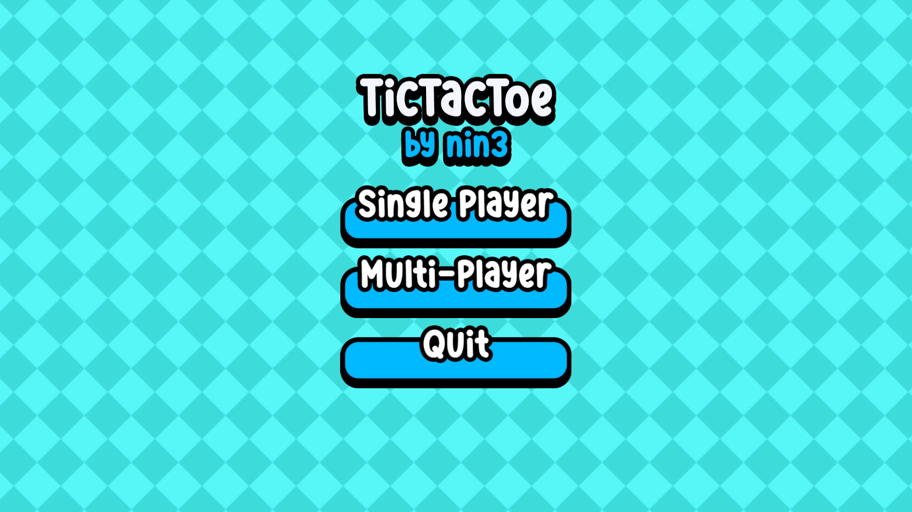
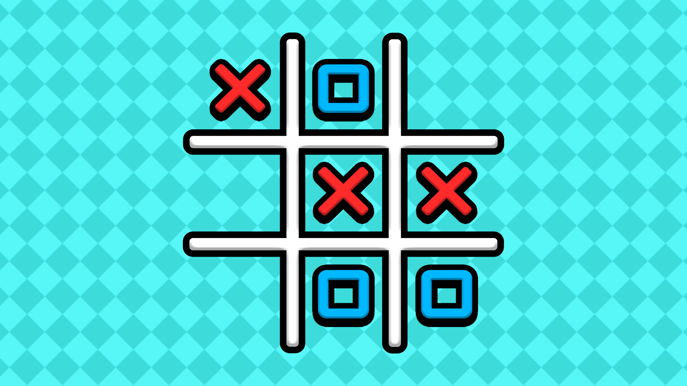
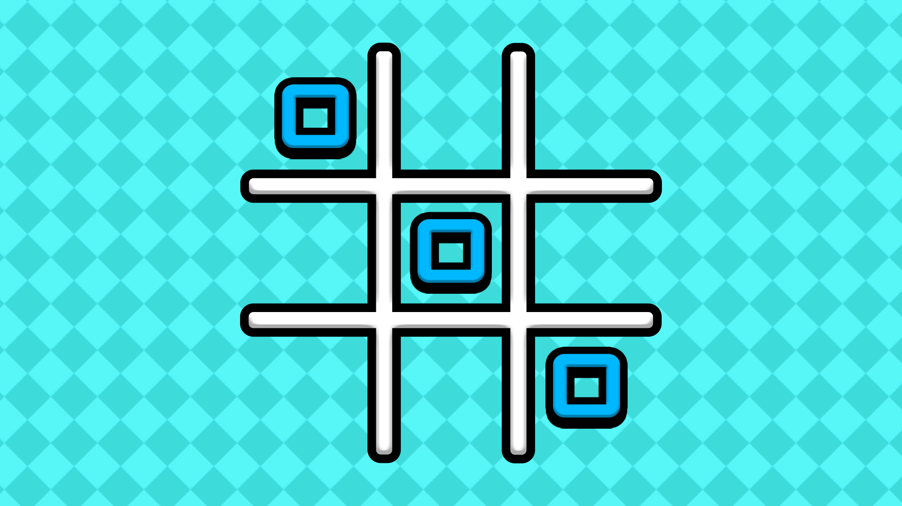
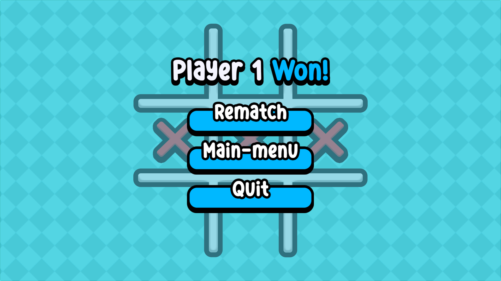

# Tictactoe with Minimax Algorithm

## Description

This is a simple implementation of the game Tic Tac Toe using the Minimax algorithm. The game allows two players to take turns placing their marks on a 3x3 grid. The objective of the game is to get three of your marks in a row, either horizontally, vertically, or diagonally.

## Features

- Single-player mode against an AI opponent using the Minimax algorithm
- Two-player mode for playing against a friend
- Interactive and user-friendly interface
- Win detection and game over state
- Restart option to play again

## How to play

1. The game starts with an empty 3x3 grid.
2. Player 1 (X) goes first and places their mark in an empty cell.
3. Player 2 (O) goes next and places their mark in an empty cell.
4. Players take turns until one of them wins or the game ends in a draw.
5. To win, a player must have three of their marks in a row, either horizontally, vertically, or diagonally.
6. If all cells are filled and no player has won, the game ends in a draw.

## Where to play

The game is playable in the browser at: [https://therealnin3.itch.io/tictactoe](https://therealnin3.itch.io/tictactoe)

## Screenshots

## What I've learned and will improve in the future

During the development of this project, I learned about the Minimax algorithm and its application in creating an AI opponent for the game Tic Tac Toe. In the future, I plan to improve the AI's strategy and make it more challenging to play against.
